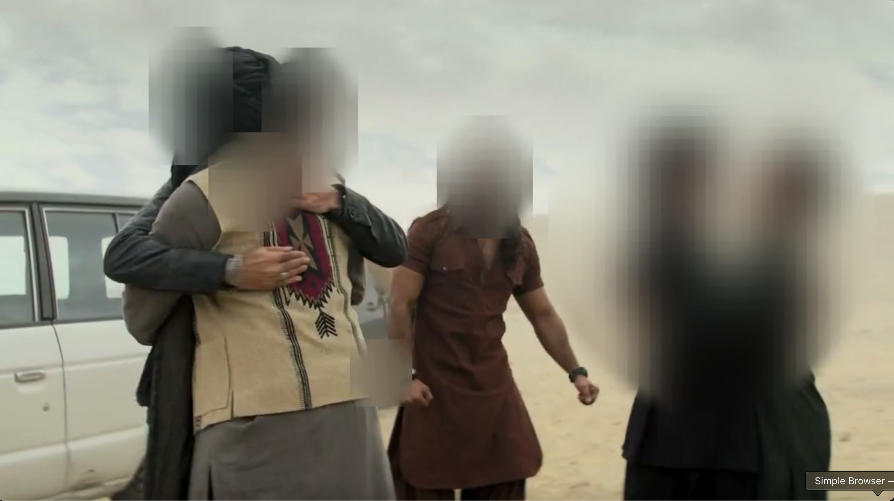

# 🔒 Face Blur

**Privacy-First Automatic Face Blurring for Videos** — Protect protesters, journalists, and activists with AI-powered face detection achieving 99%+ accuracy.

[](https://opensource.org/licenses/MIT)
[](https://www.python.org/downloads/)
[](https://fastapi.tiangolo.com/)

---

## 🎯 Why Face Blur?

In an era of mass surveillance, protecting the identity of protesters, activists, and journalists is critical. Face Blur uses **multiple AI models** running in parallel to ensure no face is missed — because when it comes to privacy, 99% isn't good enough.

### Key Features

- **🔒 Privacy-First**: When in doubt, blur — designed to never miss a face
- **👓 Handles Difficult Cases**: Sunglasses, partial faces, profiles, looking down
- **🎬 Quality Preservation**: Maintains original resolution, framerate, and audio
- **⚡ Frame Tracking**: Optical flow ensures continuity between frames
- **🌐 Simple Interface**: Upload → Process → Download

---

## 📸 Sample Results

| Before | After |
|--------|-------|
|  |  |

*All faces automatically detected and blurred — including those with sunglasses and looking away.*

---

## 🖼️ How It Works

```
┌─────────────────────────────────────────────────────────────────┐
│                        VIDEO INPUT                               │
└─────────────────────────────────────────────────────────────────┘
                              │
                              ▼
┌─────────────────────────────────────────────────────────────────┐
│                    FRAME EXTRACTION (FFmpeg)                     │
└─────────────────────────────────────────────────────────────────┘
                              │
                              ▼
┌─────────────────────────────────────────────────────────────────┐
│                   MULTI-MODEL FACE DETECTION                     │
│  ┌──────────┐ ┌──────────┐ ┌──────────┐ ┌──────────┐ ┌────────┐ │
│  │ OpenCV   │ │MediaPipe │ │  YuNet   │ │  Haar    │ │Profile │ │
│  │   DNN    │ │          │ │          │ │ Cascade  │ │  Det.  │ │
│  └──────────┘ └──────────┘ └──────────┘ └──────────┘ └────────┘ │
│                              │                                   │
│                    ┌─────────┴─────────┐                        │
│                    │  MERGE & EXPAND   │                        │
│                    │   DETECTIONS      │                        │
│                    └───────────────────┘                        │
└─────────────────────────────────────────────────────────────────┘
                              │
                              ▼
┌─────────────────────────────────────────────────────────────────┐
│                 OPTICAL FLOW TRACKING                            │
│            (Maintains blur across frames)                        │
└─────────────────────────────────────────────────────────────────┘
                              │
                              ▼
┌─────────────────────────────────────────────────────────────────┐
│                    GAUSSIAN BLUR APPLICATION                     │
│                  (Strong blur + feathered edges)                 │
└─────────────────────────────────────────────────────────────────┘
                              │
                              ▼
┌─────────────────────────────────────────────────────────────────┐
│                 VIDEO REASSEMBLY (FFmpeg + Audio)                │
└─────────────────────────────────────────────────────────────────┘
                              │
                              ▼
┌─────────────────────────────────────────────────────────────────┐
│                       BLURRED VIDEO OUTPUT                       │
└─────────────────────────────────────────────────────────────────┘
```

---

## 🚀 Quick Start

### Prerequisites

- Python 3.11+
- FFmpeg installed (`brew install ffmpeg` on macOS)
- Git

### Installation

```bash
# Clone the repository
git clone git@github.com:yasinhajilou/face-blur.git
cd face-blur

# Set up the backend
cd backend
python3 -m venv venv
source venv/bin/activate  # On Windows: venv\Scripts\activate
pip install -r requirements.txt

# Models are downloaded automatically on first run
```

### Running Locally

**Terminal 1 - Backend:**
```bash
cd backend
source venv/bin/activate
python -m uvicorn main:app --host 0.0.0.0 --port 8000
```

**Terminal 2 - Frontend:**
```bash
cd frontend
python3 -m http.server 3000
```

**Open http://localhost:3000 in your browser**

---

## 🏗️ Project Structure

```
face-blur/
├── backend/
│   ├── main.py              # FastAPI server & API endpoints
│   ├── processor.py         # Video processing & face detection
│   ├── requirements.txt     # Python dependencies
│   ├── setup.sh             # Server setup script
│   ├── faceblur.service     # Systemd service file
│   └── models/              # AI models (auto-downloaded)
│       ├── deploy.prototxt
│       ├── res10_300x300_ssd_iter_140000.caffemodel
│       ├── face_detection_yunet_2023mar.onnx
│       └── blaze_face_short_range.tflite
│
├── frontend/
│   ├── index.html           # Main page
│   ├── style.css            # Styles
│   └── app.js               # Frontend logic
│
├── README.md
└── LICENSE
```

---

## 🔧 Detection Methods

Face Blur uses **5 parallel detection methods** to achieve maximum accuracy:

| Method | Strengths | Model |
|--------|-----------|-------|
| **OpenCV DNN** | Fast, reliable base detection | Caffe SSD |
| **MediaPipe** | Excellent for frontal faces | BlazeFace |
| **YuNet** | Various poses, expressions | ONNX |
| **Haar Cascades** | Sunglasses, different lighting | OpenCV built-in |
| **Profile Detection** | Side-facing faces | Haar profile cascade |

Additionally:
- **Optical Flow Tracking**: Maintains face positions between frames
- **Detection Merging**: Combines overlapping detections
- **Box Expansion**: Expands detected regions by 40% for safety

---

## ⚙️ Configuration

### Backend (`processor.py`)

```python
# Detection confidence thresholds
detection_confidence = 0.25    # Lower = more detections
blur_expand_ratio = 1.4        # Expand detected faces by 40%

# MediaPipe settings
min_detection_confidence = 0.2  # Very sensitive

# Haar cascade settings
scaleFactor = 1.05             # Fine-grained scaling
minNeighbors = 2               # Accept more candidates
```

### Frontend (`app.js`)

```javascript
MAX_FILE_SIZE: 500 * 1024 * 1024,  // 500MB
MAX_DURATION_SECONDS: 300,          // 5 minutes
MAX_POLL_ATTEMPTS: 3600,            // 60 min timeout
```

---

## 🌐 Deployment

### Oracle Cloud (Free Tier)

1. Create an ARM-based VM (Ampere A1 - 4 cores, 24GB RAM free)
2. SSH into the VM and run:

```bash
# Clone and setup
git clone git@github.com:yasinhajilou/face-blur.git
cd face-blur/backend
chmod +x setup.sh
./setup.sh

# Start the service
sudo systemctl start faceblur
sudo systemctl enable faceblur
```

### Cloudflare Pages (Frontend)

1. Fork this repository
2. Connect to Cloudflare Pages
3. Set build settings:
   - Build command: (none)
   - Build output directory: `frontend`
4. Update `API_URL` in `frontend/app.js` to your backend URL

---

## 📊 API Reference

### `POST /api/upload`
Upload a video for processing.

**Request:**
- `file`: Video file (MP4, MOV, AVI)

**Response:**
```json
{
  "job_id": "uuid",
  "status": "queued",
  "message": "Video uploaded successfully"
}
```

### `GET /api/status/{job_id}`
Check processing status.

**Response:**
```json
{
  "job_id": "uuid",
  "status": "processing",
  "progress": 45
}
```
Status values: `queued` | `processing` | `complete` | `error`

### `GET /api/download/{job_id}`
Download the processed video.

### `POST /api/cleanup/{job_id}`
Delete temporary files for a job.

---

## 🛡️ Privacy & Security

- **No Storage**: Videos are deleted after 1 hour
- **No Tracking**: No analytics or user tracking
- **Local Processing**: All face detection runs on your server
- **Open Source**: Audit the code yourself

---

## 📈 Performance

| Video Length | Resolution | Processing Time* |
|--------------|------------|-----------------|
| 30 seconds   | 1080p      | ~2 minutes      |
| 1 minute     | 1080p      | ~4 minutes      |
| 5 minutes    | 1080p      | ~20 minutes     |

*On Apple M1 Pro. Times vary based on face count and complexity.

---

## 🤝 Contributing

Contributions are welcome! Areas that need work:

- [ ] GPU acceleration (CUDA/Metal)
- [ ] Real-time streaming support
- [ ] Additional detection models
- [ ] Batch processing
- [ ] Docker containerization

---

## 📄 License

MIT License - see [LICENSE](LICENSE) for details.

---

## 🙏 Acknowledgments

- [OpenCV](https://opencv.org/) - Computer vision library
- [MediaPipe](https://mediapipe.dev/) - Google's ML solutions
- [YuNet](https://github.com/opencv/opencv_zoo) - Fast face detection
- [FastAPI](https://fastapi.tiangolo.com/) - Modern Python web framework
- [FFmpeg](https://ffmpeg.org/) - Video processing

---

<p align="center">
  <strong>Built with ❤️ for privacy and human rights.</strong>
</p>
